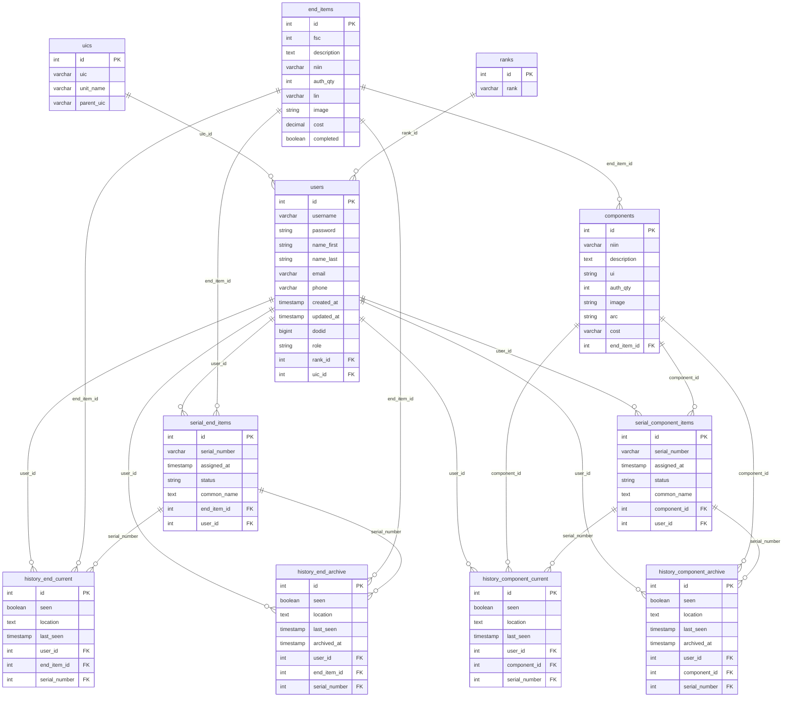

# TORCH - Transfer of Records and Command Hand-receipt

A web-based military property accountability application designed for use at the detachment/platoon level.

## Tech Stack

- React (Vite) - Frontend
- Express - Backend
- PostgreSQL - Database

## Getting Started

### Prerequisites

- Node.js v18+
- PostgreSQL

### Install Dependencies

```bash
# Install client dependencies
cd client && npm install

# Install server dependencies
cd backend && npm install
```

### Run the App

```bash
# Run client
cd client && npm run dev

# Run server
cd backend && npm run dev
```

---

## Database Schema



---

## API Reference

**Base URL:** `http://localhost:8080`

### Authentication

All protected routes require a valid JWT session cookie set by `POST /auth/login`. The cookie is `httpOnly`, expires
after 7 days, and is named `token`.

### Role Permissions

| Role    | Access Level                                             |
|---------|----------------------------------------------------------|
| `user`  | Read access to most resources                            |
| `hrh`   | Can create resources (POST endpoints)                    |
| `admin` | Can update and delete resources (PATCH/DELETE endpoints) |

### Error Format

All errors return:

```json
{
  "message": "error description"
}
```

| Status | Meaning                                 |
|--------|-----------------------------------------|
| `400`  | Bad request / missing fields            |
| `401`  | Missing or invalid token                |
| `403`  | Insufficient role                       |
| `404`  | Resource not found                      |
| `409`  | Conflict (e.g. duplicate serial number) |
| `500`  | Server error                            |

---

### Auth — `/auth`

#### `POST /auth/register` — No auth required

Create a new user account.

**Request body:**

```json
{
  "username": "jsmith",
  "name_first": "John",
  "name_last": "Smith",
  "email": "jsmith@example.com",
  "password": "secret",
  "phone": "555-1234",
  "rank": "E-7",
  "uic": "WCAEB1",
  "role": "user",
  "dodid": "1234567890"
}
```

All fields required. `rank` must match an existing rank value. `uic` must match an existing UIC code.

**Response `201`:**

```json
{
  "newUser": {
    "username": "jsmith",
    "name_first": "John",
    "name_last": "Smith",
    "email": "jsmith@example.com",
    "phone": "555-1234",
    "rank_id": 7,
    "rank": "E-7",
    "uic_id": 1,
    "uic": "WCAEB1",
    "role": "user",
    "dodid": "1234567890"
  }
}
```

**Errors `400`:** Missing fields, email/username already in use, invalid rank or UIC.

---

#### `POST /auth/login` — No auth required

Authenticate and receive a session cookie.

**Request body:**

```json
{
  "email": "jsmith@example.com",
  "password": "secret"
}
```

**Response `200`:** Sets `httpOnly` cookie `token` (7-day expiry) and returns the token.

```json
{
  "token": "<jwt>"
}
```

**Errors:** `400` missing fields, `401` user not found or wrong password.

---

#### `GET /auth/me` — Auth required

Get the currently authenticated user's profile.

**Request:** No body.

**Response `200`:**

```json
{
  "user": {
    "id": 1,
    "username": "jsmith",
    "name_first": "John",
    "name_last": "Smith",
    "email": "jsmith@example.com",
    "phone": "555-1234",
    "role": "user",
    "rank_id": 7,
    "rank": "E-7",
    "uic_id": 1,
    "uic": "WCAEB1",
    "created_at": "timestamp",
    "updated_at": "timestamp"
  }
}
```

---

#### `POST /auth/logout` — Auth required

Clear the session cookie.

**Request:** No body.

**Response `200`:**

```json
{
  "message": "Logged out."
}
```

---

### Users — `/users`

All endpoints require authentication. PATCH and DELETE require `hrh` role.

#### `GET /users`

Get all users. Supports filtering, sorting, and pagination.

**Query params:**
| Param | Description |
|-------|-------------|
| `id` | Filter by user ID |
| `q` | Search username, email, name_first, name_last |
| `sort_by` | Field to sort by (default: `id`) |
| `order` | `asc` or `desc` (default: `asc`) |
| `limit` | Max results (1–100) |
| `offset` | Pagination offset (default: `0`) |

**Response `200`:**

```json
{
  "allUsers": [
    {
      "id": 1,
      "username": "jsmith",
      "name_first": "John",
      "name_last": "Smith",
      "email": "jsmith@example.com",
      "phone": "555-1234",
      "dodid": "1234567890",
      "role": "user",
      "rank": "E-7",
      "uic": "WCAEB1",
      "unit_name": "1st Battalion",
      "parent_uic": "W1A1AB",
      "created_at": "timestamp",
      "updated_at": "timestamp"
    }
  ]
}
```

---

#### `GET /users/:id`

Get a single user by ID.

**Response `200`:**

```json
{
  "user": {
    "/* same shape as GET /users item */"
  }
}
```

**Errors `404`:** User not found.

---

#### `PATCH /users/:id` — Admin required

Update a user. All fields optional — send only fields to update.

**Request body:**

```json
{
  "username": "jsmith2",
  "name_first": "John",
  "name_last": "Smith",
  "email": "jsmith2@example.com",
  "password": "newpassword",
  "phone": "555-9999",
  "rank": "E-7",
  "uic_id": 1,
  "role": "hrh",
  "DoDID": "0987654321"
}
```

**Response `200`:**

```json
{
  "updatedUser": {
    "/* updated user object */"
  },
  "message": "'jsmith2' has been successfully updated."
}
```

**Errors:** `400` no changes detected, `404` user not found.

---

#### `DELETE /users/:id` — Admin required

Delete a user by ID.

**Response `200`:**

```json
{
  "deletedUser": {
    "/* deleted user object */"
  },
  "message": "'jsmith' was successfully deleted."
}
```

**Errors `404`:** User not found.

---

### UICs — `/uics`

GET endpoints are public. POST requires `hrh` role. PATCH and DELETE require `hrh` role.

#### `GET /uics`

Get all UICs. Supports filtering, sorting, and pagination.

**Query params:**
| Param | Description |
|-------|-------------|
| `q` | Search the `uic` field |
| `sort_by` | Field to sort by |
| `order` | `asc` or `desc` |
| `limit` | Max results |
| `offset` | Pagination offset |

**Response `200`:**

```json
{
  "allUics": [
    {
      "id": 1,
      "uic": "WCAEB1",
      "unit_name": "1st Battalion",
      "parent_uic": "W1A1AB"
    }
  ]
}
```

---

#### `GET /uics/:id`

Get a single UIC by ID.

**Response `200`:**

```json
{
  "uic": {
    "/* same shape as GET /uics item */"
  }
}
```

**Errors `404`:** UIC not found.

---

#### `POST /uics` — HRH role required

Create a new UIC.

**Request body:**

```json
{
  "uic": "W1A1AA",
  "unit_name": "1st Battalion",
  "parent_uic": "W1A1AB"
}
```

All fields required.

**Response `201`:**

```json
{
  "newUic": {
    "id": 1,
    "uic": "W1A1AA",
    "unit_name": "1st Battalion",
    "parent_uic": "W1A1AB"
  },
  "message": "UIC 'W1A1AA' has been successfully created."
}
```

**Errors `400`:** Missing fields.

---

#### `PATCH /uics/:id` — Admin required

Update a UIC. All fields optional.

**Request body:**

```json
{
  "uic": "W1A1AA",
  "unit_name": "2nd Battalion",
  "parent_uic": "W1A1AC"
}
```

**Response `200`:**

```json
{
  "updatedUic": {
    "/* updated uic object */"
  },
  "message": "UIC 'W1A1AA' has been successfully updated."
}
```

**Errors `404`:** UIC not found.

---

#### `DELETE /uics/:id` — Admin required

Delete a UIC by ID.

**Response `200`:**

```json
{
  "deletedUic": {
    "/* deleted uic object */"
  },
  "message": "UIC 'W1A1AA' was successfully deleted."
}
```

**Errors `404`:** UIC not found.

---

### End Items — `/end-items`

All endpoints require authentication. POST requires `hrh` role. PATCH and DELETE require `hrh` role.

#### `GET /end-items`

Get all end items. Supports filtering, sorting, and pagination.

**Query params:**
| Param | Description |
|-------|-------------|
| `id` | Filter by ID |
| `description` | Substring match on description |
| `niin` | Substring match on NIIN |
| `fsc` | Substring match on FSC |
| `lin` | Substring match on LIN |
| `sort_by` | Field to sort by |
| `order` | `asc` or `desc` |
| `limit` | Max results |
| `offset` | Pagination offset |

**Response `200`:**

```json
{
  "allEndItems": [
    {
      "id": 1,
      "fsc": "1005",
      "description": "RIFLE,5.56 MILLIMETER",
      "niin": "016191936",
      "image": "url-or-path",
      "auth_qty": 1,
      "lin": "R97777",
      "completed": false,
      "created_at": "timestamp",
      "updated_at": "timestamp"
    }
  ]
}
```

---

#### `GET /end-items/:id`

Get a single end item by ID.

**Response `200`:**

```json
{
  "endItem": {
    "/* same shape as GET /end-items item */"
  }
}
```

**Errors `404`:** End item not found.

---

#### `GET /end-items/uic/:uic_id`

Get all end items assigned to a UIC.

**Response `200`:**

```json
{
  "endItems": [
    {
      "/* end item objects */"
    }
  ]
}
```

**Errors `404`:** UIC does not exist or no end items recorded.

---

#### `POST /end-items` — HRH role required

Create a new end item.

**Request body:**

```json
{
  "fsc": "1005",
  "description": "RIFLE,5.56 MILLIMETER",
  "niin": "016191936",
  "image": "url-or-path",
  "auth_qty": 1,
  "lin": "R97777"
}
```

All fields required.

**Response `201`:**

```json
{
  "newEndItem": {
    "/* end item object */"
  },
  "message": "LIN: R97777 has been successfully created."
}
```

**Errors `400`:** Missing fields.

---

#### `PATCH /end-items/:id` — Admin required

Update an end item. All fields optional.

**Request body:**

```json
{
  "fsc": "1005",
  "description": "RIFLE,5.56 MILLIMETER",
  "niin": "016191936",
  "image": "url-or-path",
  "auth_qty": 2,
  "lin": "R97777",
  "completed": true
}
```

**Response `200`:**

```json
{
  "updatedEndItem": {
    "/* updated end item object */"
  },
  "message": "LIN: R97777 has been successfully updated."
}
```

**Errors `404`:** End item not found.

---

#### `PATCH /end-items/:id/complete` — Admin required

Mark an end item as complete. No body needed.

**Response `200`:**

```json
{
  "updatedEndItem": {
    "/* end item object with completed: true */"
  },
  "message": "LIN: R97777 has been marked complete."
}
```

---

#### `DELETE /end-items/:id` — Admin required

Delete an end item by ID.

**Response `200`:**

```json
{
  "deletedEndItem": {
    "/* deleted end item object */"
  },
  "message": "LIN: R97777 was successfully deleted."
}
```

**Errors `404`:** End item not found.

---

### Components — `/components`

All endpoints require authentication. POST requires `hrh` role. PATCH and DELETE require `hrh` role.

#### `GET /components`

Get all components. Supports filtering, sorting, and pagination.

**Query params:**
| Param | Description |
|-------|-------------|
| `id` | Filter by ID |
| `description` | Substring match on description |
| `niin` | Substring match on NIIN |
| `arc` | Substring match on ARC |
| `end_item_id` | Filter by end item ID |
| `sort_by` | Field to sort by |
| `order` | `asc` or `desc` |
| `limit` | Max results |
| `offset` | Pagination offset |

**Response `200`:**

```json
{
  "allComponents": [
    {
      "id": 1,
      "niin": "123456789",
      "description": "MAGAZINE,30-ROUND",
      "ui": "EA",
      "auth_qty": 6,
      "image": "url-or-path",
      "arc": "B",
      "end_item_id": 1,
      "created_at": "timestamp",
      "updated_at": "timestamp"
    }
  ]
}
```

---

#### `GET /components/:id`

Get a single component by ID.

**Response `200`:**

```json
{
  "component": {
    "/* same shape as GET /components item */"
  }
}
```

**Errors `404`:** Component not found.

---

#### `GET /components/uic/:uic_id`

Get all components assigned to a UIC.

**Response `200`:**

```json
{
  "components": [
    {
      "/* component objects */"
    }
  ]
}
```

**Errors `404`:** UIC does not exist or no components recorded.

---

#### `POST /components` — HRH role required

Create a new component. Associates the component to an end item via LIN.

**Request body:**

```json
{
  "niin": "123456789",
  "description": "MAGAZINE,30-ROUND",
  "ui": "EA",
  "auth_qty": 6,
  "image": "url-or-path",
  "arc": "B",
  "end_item_lin": "R97777"
}
```

All fields required. `end_item_lin` must match an existing end item's LIN.

**Response `201`:**

```json
{
  "newComponent": {
    "/* component object */"
  },
  "message": "NIIN: 123456789 has been successfully created."
}
```

**Errors `400`:** Missing fields.

---

#### `PATCH /components/:id` — Admin required

Update a component. All fields optional.

**Request body:**

```json
{
  "niin": "123456789",
  "description": "MAGAZINE,30-ROUND",
  "ui": "EA",
  "auth_qty": 4,
  "image": "url-or-path",
  "arc": "B"
}
```

**Response `200`:**

```json
{
  "updatedComponent": {
    "/* updated component object */"
  },
  "message": "NIIN: 123456789 has been successfully updated."
}
```

**Errors:** `400` no changes detected, `404` component not found.

---

#### `DELETE /components/:id` — Admin required

Delete a component by ID.

**Response `200`:**

```json
{
  "deletedComponent": {
    "/* deleted component object */"
  },
  "message": "NIIN: 123456789 was successfully deleted."
}
```

**Errors `404`:** Component not found.

---

### Serial Items — `/serial-items`

All endpoints require authentication. POST requires `hrh` role. PATCH and DELETE require `hrh` role.

#### `GET /serial-items`

Get all serial end items. Supports filtering, sorting, and pagination.

**Query params:**
| Param | Description |
|-------|-------------|
| `id` | Filter by ID |
| `serial_number` | Substring match on serial number |
| `status` | Comma-separated status values (e.g. `serviceable,unserviceable`) |
| `sort_by` | Field to sort by |
| `order` | `asc` or `desc` |
| `limit` | Max results |
| `offset` | Pagination offset |

**Response `200`:**

```json
{
  "allSerialItems": [
    {
      "id": 1,
      "serial_number": "SN-012",
      "status": "serviceable",
      "end_item_id": 1,
      "user_id": 3,
      "created_at": "timestamp",
      "updated_at": "timestamp"
    }
  ]
}
```

---

#### `GET /serial-items/:id`

Get a single serial item by ID.

**Response `200`:**

```json
{
  "serialItem": {
    "/* same shape as GET /serial-items item */"
  }
}
```

**Errors `404`:** Serial item not found.

---

#### `GET /serial-items/uic/:uic_id`

Get all serial items assigned to a UIC.

**Response `200`:**

```json
{
  "serialItems": [
    {
      "/* serial item objects */"
    }
  ]
}
```

**Errors `404`:** UIC does not exist or no serial items recorded.

---

#### `POST /serial-items` — HRH role required

Create a new serial item. Associates to an end item via LIN and a user via DoDID.

**Request body:**

```json
{
  "serial_number": "SN-012",
  "status": "serviceable",
  "end_item_lin": "R97777",
  "user_dodid": "1234567890"
}
```

All fields required. `end_item_lin` must match an existing end item's LIN. `user_dodid` must match an existing user's
DoDID.

**Response `201`:**

```json
{
  "newSerialItem": {
    "/* serial item object */"
  },
  "message": "SN: SN-012 has been successfully posted."
}
```

**Errors `400`:** Missing fields.

---

#### `PATCH /serial-items/:id` — Admin required

Update a serial item. All fields optional.

**Request body:**

```json
{
  "serial_number": "SN-013",
  "status": "unserviceable"
}
```

**Response `200`:**

```json
{
  "updatedSerialItem": {
    "/* updated serial item object */"
  },
  "message": "SN: SN-013 has been successfully updated."
}
```

**Errors `404`:** Serial item not found.

---

#### `DELETE /serial-items/:id` — Admin required

Delete a serial item by ID.

**Response `200`:**

```json
{
  "deletedSerialItem": {
    "/* deleted serial item object */"
  },
  "message": "SN: SN-012 was successfully deleted."
}
```

**Errors `404`:** Serial item not found.

---

### Current History (End Items) — `/current-history/end-items`

Tracks the current property record for each serialized end item. Only one record per serial number can exist at a time —
creating or updating a record for an existing serial number automatically archives the old one.

All endpoints require authentication. POST requires `hrh` role. PATCH requires `hrh` role.

#### `GET /current-history/end-items`

Get all current end item history records.

**Query params:**
| Param | Description |
|-------|-------------|
| `id` | Filter by record ID |
| `serial_number` | Filter by serial number string |
| `sort_by` | Field to sort by |
| `order` | `asc` or `desc` |
| `limit` | Max results |
| `offset` | Pagination offset |

**Response `200`:**

```json
{
  "currentHistory": [
    {
      "id": 1,
      "end_item_id": 1,
      "user_id": 3,
      "serial_number": 5,
      "seen": true,
      "location": "Arms Room",
      "last_seen": "timestamp",
      "created_at": "timestamp",
      "updated_at": "timestamp"
    }
  ]
}
```

> Note: `serial_number` in the response is the foreign key ID from the `serial_end_items` table, not the human-readable
> serial number string.

---

#### `GET /current-history/end-items/:id`

Get a single current end item history record by ID.

**Response `200`:**

```json
{
  "currentHistory": {
    "/* same shape as GET /current-history/end-items item */"
  }
}
```

**Errors `404`:** Record not found.

---

#### `POST /current-history/end-items` — HRH role required

Create a current history record for an end item.

If a record already exists for the given `serial_number`, the existing record is automatically archived before the new
one is created.

**Request body:**

```json
{
  "end_item_id": 1,
  "user_id": 3,
  "seen": true,
  "location": "Arms Room",
  "last_seen": "2024-01-15T08:00:00Z",
  "serial_number": "SN-012"
}
```

All fields required. `serial_number` is the human-readable string (e.g. `"SN-012"`) — it is resolved to the internal ID
automatically.

**Response `201`:**

```json
{
  "newCurrentHistory": {
    "/* current history object */"
  },
  "message": "ID: 1 has been successfully created."
}
```

**Errors `400`:** Missing fields.

---

#### `PATCH /current-history/end-items/:id` — Admin required

Update a current end item history record.

The existing record is archived before the update is applied.

**Request body** (all optional):

```json
{
  "end_item_id": 1,
  "user_id": 3,
  "seen": false,
  "location": "Motor Pool",
  "last_seen": "2024-01-20T10:00:00Z",
  "serial_number": "SN-012"
}
```

**Response `200`:**

```json
{
  "updatedCurrentHistory": {
    "/* updated current history object */"
  },
  "message": "ID: 1 has been successfully updated."
}
```

**Errors:** `404` record not found, `409` serial number already has a current history record.

---

### Current History (Components) — `/current-history/components`

Tracks the current property record for each component. For serialized components, only one record per serial number can
exist at a time. Unserialized (bulk) components are tracked by `component_id`.

All endpoints require authentication. POST requires `hrh` role. PATCH requires `hrh` role.

#### `GET /current-history/components`

Get all current component history records.

**Query params:** Same as `/current-history/end-items`.

**Response `200`:**

```json
{
  "currentHistory": [
    {
      "id": 1,
      "component_id": 2,
      "user_id": 3,
      "serial_number": 4,
      "seen": true,
      "location": "Arms Room",
      "last_seen": "timestamp",
      "created_at": "timestamp",
      "updated_at": "timestamp"
    }
  ]
}
```

> Note: `serial_number` is the foreign key ID from the `serial_component_items` table. It is `null` for unserialized
> components.

---

#### `GET /current-history/components/:id`

Get a single current component history record by ID.

**Response `200`:**

```json
{
  "currentHistory": {
    "/* same shape as GET /current-history/components item */"
  }
}
```

**Errors `404`:** Record not found.

---

#### `POST /current-history/components` — HRH role required

Create a current history record for a component.

If a record already exists for the given `serial_number` (or for the same unserialized `component_id`), the existing
record is automatically archived before the new one is created.

**Request body:**

```json
{
  "component_id": 2,
  "user_id": 3,
  "seen": true,
  "location": "Arms Room",
  "last_seen": "2024-01-15T08:00:00Z",
  "serial_number": "SN-MAG-001"
}
```

`component_id`, `user_id`, `seen`, `location`, and `last_seen` are required. `serial_number` is optional — omit it for
unserialized (bulk) components. When provided, it is resolved to the internal serial component item ID automatically.

**Response `201`:**

```json
{
  "newCurrentHistory": {
    "/* current history object */"
  },
  "message": "ID: 1 has been successfully created."
}
```

**Errors `400`:** Missing required fields.

---

#### `PATCH /current-history/components/:id` — Admin required

Update a current component history record.

The existing record is archived before the update is applied.

**Request body** (all optional):

```json
{
  "component_id": 2,
  "user_id": 3,
  "seen": false,
  "location": "Supply Room",
  "last_seen": "2024-01-20T10:00:00Z",
  "serial_number": "SN-MAG-001"
}
```

**Response `200`:**

```json
{
  "updatedCurrentHistory": {
    "/* updated current history object */"
  },
  "message": "ID: 1 has been successfully updated."
}
```

**Errors:** `404` record not found, `409` serial number already has a current history record.

---

### Archived History (End Items) — `/archived-history/end-items`

Read-only audit trail of past end item history records. Records are written here automatically when a current history
record is replaced or updated — do not create them manually unless necessary.

All endpoints require authentication. POST requires `hrh` role.

#### `GET /archived-history/end-items`

Get all archived end item history records.

**Query params:** Same as `/current-history/end-items`.

**Response `200`:**

```json
{
  "archivedHistory": [
    {
      "id": 1,
      "end_item_id": 1,
      "user_id": 3,
      "serial_number": 5,
      "seen": true,
      "location": "Arms Room",
      "last_seen": "timestamp",
      "created_at": "timestamp",
      "updated_at": "timestamp"
    }
  ]
}
```

---

#### `GET /archived-history/end-items/:id`

Get a single archived end item history record by ID.

**Response `200`:**

```json
{
  "archivedHistory": {
    "/* same shape as GET /archived-history/end-items item */"
  }
}
```

**Errors `404`:** Record not found.

---

#### `POST /archived-history/end-items` — HRH role required

Manually create an archived end item history record.

**Request body:**

```json
{
  "end_item_id": 1,
  "user_id": 3,
  "seen": true,
  "location": "Arms Room",
  "last_seen": "2024-01-15T08:00:00Z",
  "serial_number": 5
}
```

All fields required. `serial_number` here is the numeric foreign key ID from `serial_end_items` (not the string serial
number).

**Response `201`:**

```json
{
  "newArchivedHistory": {
    "/* archived history object */"
  },
  "message": "ID: 1 has been successfully created."
}
```

**Errors `400`:** Missing fields.

---

### Archived History (Components) — `/archived-history/components`

Read-only audit trail of past component history records.

All endpoints require authentication. POST requires `hrh` role.

#### `GET /archived-history/components`

Get all archived component history records.

**Query params:** Same as `/current-history/end-items`.

**Response `200`:**

```json
{
  "archivedHistory": [
    {
      "id": 1,
      "component_id": 2,
      "user_id": 3,
      "serial_number": 4,
      "seen": true,
      "location": "Arms Room",
      "last_seen": "timestamp",
      "created_at": "timestamp",
      "updated_at": "timestamp"
    }
  ]
}
```

> Note: `serial_number` is `null` for unserialized components.

---

#### `GET /archived-history/components/:id`

Get a single archived component history record by ID.

**Response `200`:**

```json
{
  "archivedHistory": {
    "/* same shape as GET /archived-history/components item */"
  }
}
```

**Errors `404`:** Record not found.

---

#### `POST /archived-history/components` — HRH role required

Manually create an archived component history record.

**Request body:**

```json
{
  "component_id": 2,
  "user_id": 3,
  "seen": true,
  "location": "Arms Room",
  "last_seen": "2024-01-15T08:00:00Z",
  "serial_number": 4
}
```

`component_id`, `user_id`, `seen`, `location`, and `last_seen` are required. `serial_number` is optional (omit for
unserialized components). When provided, use the numeric FK ID from `serial_component_items`.

**Response `201`:**

```json
{
  "newArchivedHistory": {
    "/* archived history object */"
  },
  "message": "ID: 1 has been successfully created."
}
```

**Errors `400`:** Missing required fields.

---

### Ingest — `/ingest`

Bulk upload endpoints for importing property data from Excel files. Both require `hrh` role.

#### `POST /ingest/end-items` — HRH role required

Upload an Excel file to bulk-import end items and their serial numbers.

**Content-Type:** `multipart/form-data`

**Request:** Form field `file` containing an `.xlsx` file with these columns:

| Excel Column           | Required | Type   | Maps To                |
|------------------------|----------|--------|------------------------|
| `LIN Number / DODIC`   | Yes      | String | LIN                    |
| `FSC`                  | Yes      | Number | FSC                    |
| `Material`             | Yes      | String | NIIN                   |
| `Material Description` | Yes      | String | Description            |
| `Stock`                | No       | Number | auth_qty (default: 1)  |
| `Unit of Measure`      | No       | String | UI (default: `EA`)     |
| `Serial Number`        | No       | Number | Serial Number          |
| `End Item LIN`         | Yes      | String | Associates to end item |

**Behavior:** Duplicate serial numbers are skipped. If all rows already exist, returns `400`.

**Response `201`:**

```json
{
  "message": "Upload successful."
}
```

**Errors:** `400` no file uploaded or all rows are duplicates, `500` Excel parse error.

---

#### `POST /ingest/components` — HRH role required

Upload an Excel file to bulk-import components.

**Content-Type:** `multipart/form-data`

**Request:** Same Excel format as `/ingest/end-items`.

**Response `201`:**

```json
{
  "message": "Upload successful."
}
```

**Errors:** Same as `/ingest/end-items`.

---

## Dashboard Logic

### Data Sources

The dashboard pulls from 6 backend endpoints on a 5-second polling interval using `react-query`:

| Data                   | Endpoint                      | Purpose                                                                      |
|------------------------|-------------------------------|------------------------------------------------------------------------------|
| End Items              | `/end-items`                  | Master list of equipment types (laptops, vehicles, etc.)                     |
| Components             | `/components`                 | Sub-items belonging to end items, each with an `auth_qty` per parent         |
| Serial End Items       | `/serial-items`               | Registered physical units of each end item (one row = one serial number)     |
| Serial Component Items | `/serial-components`          | Registered physical units of each component (one row = one serial number)    |
| End Item History       | `/current-history/end-items`  | Inventory scan results per end item serial — tracks whether each was `seen`  |
| Component History      | `/current-history/components` | Inventory scan results per component serial — tracks whether each was `seen` |

### Key Concepts

**Auth Qty vs. Registered Serials**
`end_items.auth_qty` is the authorized quantity on paper. `serial_end_items` contains the actual registered serial
numbers. The dashboard uses the registered serial count as the working authority for shortage calculations, falling back
to `auth_qty` only if no serials are registered.

**Seen vs. Not Seen**
History tables have a boolean `seen` field. A serial is considered "on hand" only when its corresponding history record
has `seen = true` AND its serial ID is in the registered set. A serial that exists but hasn't been scanned during
inventory is counted as missing.

### Completion Logic

An end item type is marked **complete** depending on whether it has components:

- **No components** — complete when every registered end item serial has been found (`seen = true`)
- **Has components** — complete when every component type's total found count meets or exceeds its scaled auth qty (see
  below)

### Component Auth Qty Scaling

Because components belong to end items, their expected quantity scales with how many end item serials are registered:

> `componentAuthQty = component.auth_qty × registeredEndItemSerialCount`

**Example:** A radio has `auth_qty = 2`. If 5 laptops are registered, the total expected radios = 10. If 2 laptops are
missing from inventory, those 10 missing radios are implicitly unaccounted for in the on-hand count.

### Shortage & Over Calculations

**End Items**

- `delta = onHand − registeredCount`
- `delta < 0` → SHORT (fewer found than registered)
- `delta > 0` → OVER (more found than registered)
- Shortage value = `|delta| × item.cost`

**Components**

- Same delta logic, but auth qty is the scaled value above
- Shortage value = `|delta| × component.cost`

### Pie Chart & Bar Chart

- **Pie chart** — ratio of complete vs. incomplete end item types using the completion logic above
- **Bar chart** — each end item type shown as a `% on hand` bar, capped at 100%, color-coded red (< 50%), yellow (
  50–85%), green (> 85%). X-axis is always fixed at 100 so bars are visually proportional.

### Shortage Summary Grid

Two tabs (End Items and Components). Each row represents an item that is either SHORT or OVER. Columns include auth qty,
on hand count, delta, status, and total shortage/surplus dollar value. The total shortage value displayed above the grid
is the sum across all short items in the active tab.

---

## Team: 'Ctrl+Alpha+Delete'

- Matthew W (Instructor)
- Brian B
- Dylan R
- Jared A
- Corey P
- Keenan M
- Jesus G
- Ben T
- Jordan P
